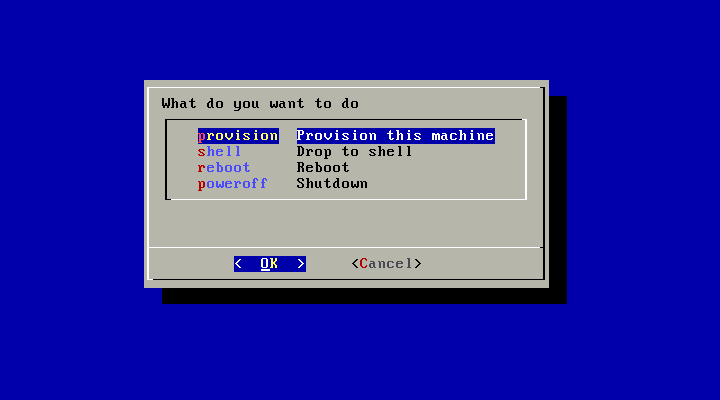
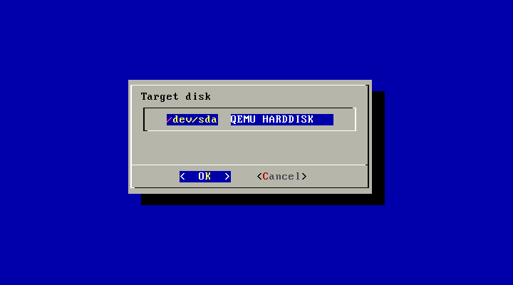
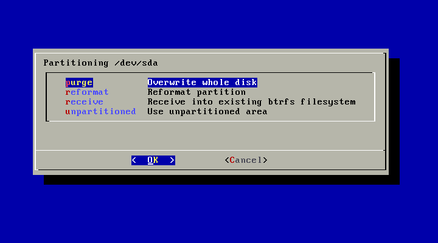
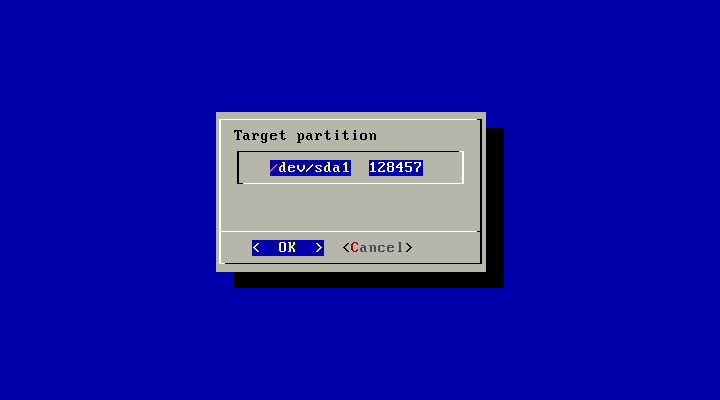
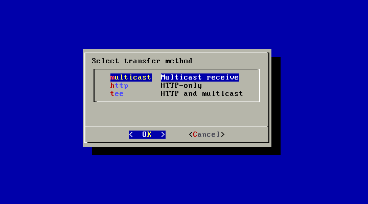
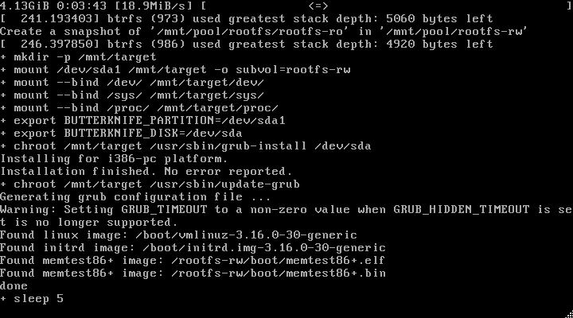

.. tags: provisioning

Bare metal provisioning
=======================

Introduction
------------

In this article I attempt to outline a workflow that can be used
to deploy hundreds of machines with relative ease.

Preparing the template
-----------------------

Use LXC to set up template machine using Puppet, Salt or your favourite
configuration management software.
Make sure you use btrfs backing store as btrfs is used for
differential snapshots.
Make sure you clean up cached packages and other stuff you might not
want to see in the production machines.
Once the template container is ready, stop the container and create a snapshot
of the container using lxc-snapshot.
We use LDAP for authentication so /etc/passwd is basically empty and we can use
same container to deploy hundreds of machines.

Buildroot based provisioning image
----------------------------------

Use Buildroot to generate self-contained Linux image to be booted using PXE
or optionally download the one I've prepared.

.. code:: bash

    git clone git://git.buildroot.net/buildroot

We managed to cram image below 10MB, so no external root filesystem is needed
for the provisioning stage.
Use menuconfig to tweak Builtroot build and kernel-menuconfig
to tweak kernel build:

.. code:: bash

    make menuconfig
    make linux-menuconfig

Enable **Kernel** -> **Linux kernel** to have kernel built by Buildroot.
Use **Filesystem images** -> **initial RAM filesystem linked into linux kernel**
to enable initramfs build, in that case the initial RAM filesystem is 
built into the kernel image.

Use **System configuration** -> **Root filesystem overlay directories**
to point to the root overlay folder which contains firstly
a customized init at /sbin/init:

.. listing:: scripts/butterknife/init.sh

And the provisioning tool itself, at /sbin/provision for instance:

.. listing:: scripts/butterknife/provision.sh

If you proxy the API through HTTPS make sure you place
your web server certificate bundle at /etc/ssl/bundle.crt of
the Buildroot filesystem overlay.

Issue make to actually build the buildroot image:

.. code:: bash

    make -j16

Serving provisioning image
--------------------------

In order to boot machines using PXE you need to have control over the
DHCP server settings, mainly you need to be able to provide
BOOTP options for the machines that are booting using PXE and requesting
boot arguments from DHCP server.
I've used OpenWrt based router to serve DHCP in the local area network.
In order to perform PXE in an OpenWrt managed network you need to add
following options in order to load pxelinux.0 from TFTP server sitting
at 192.168.72.146:

.. code:: bash

    mkdir -p /var/lib/tftp
    uci set dhcp.@dnsmasq[0].dhcp_boot=pxelinux.0,,192.168.72.146
    uci commit dhcp
    /etc/init.d/dnsmasq restart

The Ubuntu 14.04 based TFTP server sits at 192.168.72.146 and we've
prepared buildroot at ~/buildroot:

.. code:: bash

    apt-get install pxelinux atftpd openbsd-inetd
    mkdir -p /srv/tftp/pxelinux.cfg
    ln -s \
        /usr/lib/PXELINUX/pxelinux.0 \
        /usr/lib/syslinux/modules/bios/ldlinux.c32 \
        /usr/lib/syslinux/modules/bios/libutil.c32 \
        /usr/lib/syslinux/modules/bios/menu.c32 \
        /srv/tftp/
    ln -s ~/buildroot/output/images/bzImage /srv/tftp/

Also create /srv/tftp/pxelinux.cfg/default, here you may customize
butterknife_api_url to have the container snapshots fetched from another
server:

.. code::

    DEFAULT menu.c32
    PROMPT 0
    TIMEOUT 50
    MENU TITLE Butterknife provisioning tool

    label Ubuntu
            MENU LABEL Butterknife provisioning (i386)
            KERNEL bzImage
            APPEND butterknife_api_url=https://mgmt.koodur.com/api/
            TEXT HELP
                    Start the Butterknife provisioning tool
            ENDTEXT

Booting the image
-----------------

Press F12 or whatever is required on the PC to boot from network.
The SYSLINUX menu should appear, press enter to boot the provisioning image
and follow instructions on the screen.

    The main menu has convenience entries for shell, reboot and shutdown.

    Target disk selection lists /dev/sd[a-z] entries.

    Several partitioning options are provided, nothing fancy though.

    Partition selection should be polished.

    Last tee option pipes HTTP stream to multicast

    Final screen before reboot
