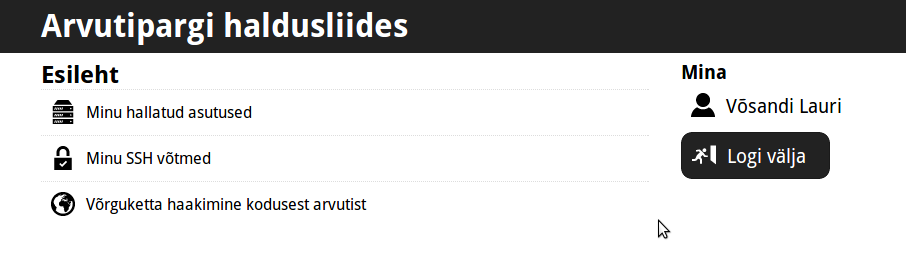
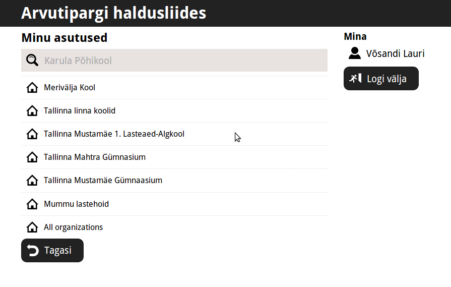

.. date: 2014-09-16
.. tags: tallinx
.. redirect_from: /2014/09/ldap2rest.html

Minimalistlik veebipõhine LDAP kasutajaliides
=============================================

Sissejuhatus
------------

Tallinna koolide Linuxile üleviimise projektis osutus problemaatiliseks
kasutajate haldus. GOsa2 ja analoogsed lahendused on resursinõudlikud,
keerukad kasutada ning eeldavad IT-juhtide välja koolitamist.
Seetõttu võtsingi kätte ja kirjutasin ise ühe [#ldap2rest]_.

Koduekraan
----------

Kasutajaliides on mobiilisõbralik kuna tihtipeale on IT-mees mööda asutust ringi seiklemas,
et abistada tavakasutajaid.

    Koduekraanil on lingid põhilistele ressurssidele, ei midagi üleliigset.

Asutused
--------

LDAP kontekstist tuntud domeeni asemel kasutasin hoopiski terminit "asutus" kuna
see on hulga loogilisem arvestades *mingi-kool.mingi-linn.edu.ee* domeenide hierarhiat.

    Ilmselt pean siia lisama veel "Lisa asutus" nupu ka ;)

    

Kasutajad
---------

Igal asutusel on omad administraatorid kes saavad kasutajaid lisada,
paroole lähtestada ning kontosid kustutada.
Kasutaja lisamine käib isikukoodi järgi selleks et protsess veel valutumaks teha.
Kasutajale saab esialgse parooli otse e-postiga saata.
Parooli lähtestamisel samuti saadetakse kasutajale ajutine parool e-postiga.

.. figure:: img/ldap2rest-useradd.png

    Kaunis ja kasutajasõbralik

Kokkuvõte
---------

Käesolev tarkvarajupp peaks elu lihtsamaks tegema neil, kes soovivad
näiteks oma lõbuks LDAP serverit käitada ning seal oma perekonna arvutite
kasutajakontosid hoida. Ubuntu baasil sülearvuteid on üsna lihtne
autentima panna vastu LDAP-i sssd [#sssd]_ abil.
EENetil on käsil projekt ühtlustada koolide arvutite autentimine
keskse LDAP-i abil ning seega pikemas perspektiivis käesolev häkk on
muidugi juba nüüd aegunud [#taat]_.

.. [#ldap2rest] https://github.com/v6sa/ldap2rest/
.. [#sssd] https://wiki.ubuntu.com/Enterprise/Authentication/sssd
.. [#taat] http://taat.ee/main/

