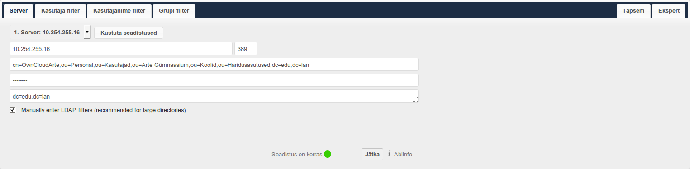
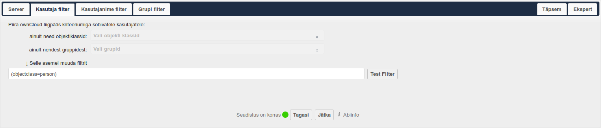
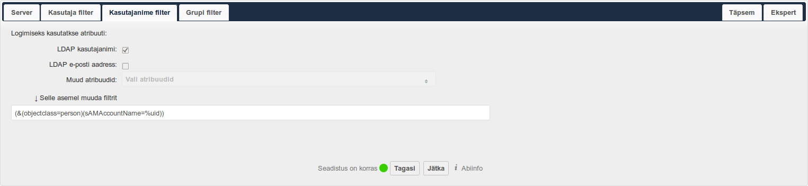
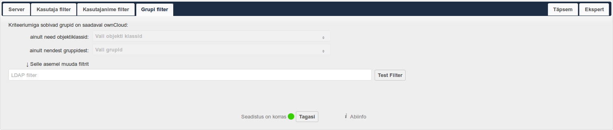
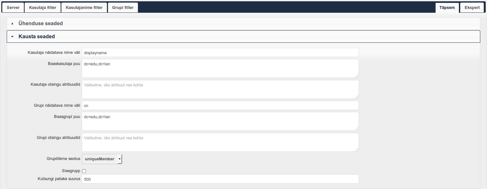
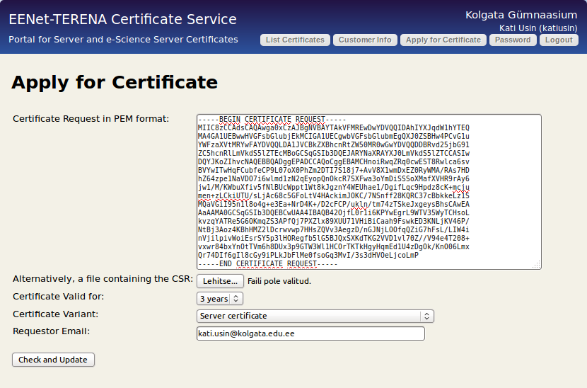
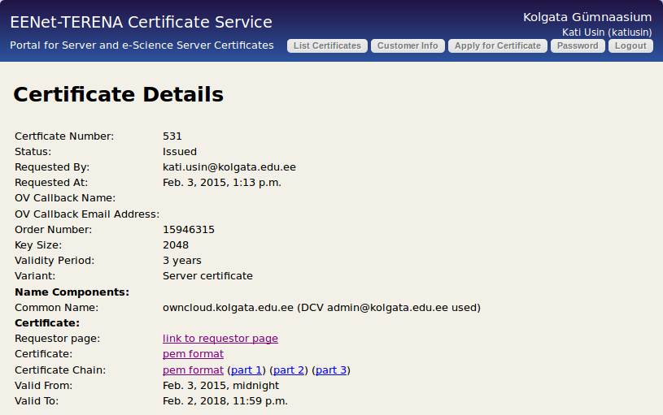

.. tags: OwnCloud

Sissejuhatus
------------

Käesolev juhend on mõeldud IT-juhile kes soovib oma haridusasutusse paigaldada
OwnCloud serverit.
OwnCloud on Dropbox ning osaliselt Google Drive funktsionaalsust asendav
avatud lähtekoodiga tarkvara, mida on võimalik paigaldada oma riistvarale.
Põhilised argumendid OwnCloudi paigaldamiseks asutuse sisse on privaatsus,
turvalisus, kettaruum ning kiirus asutuse sees.
Käesoleva artikliga püüakski lahti seletada kuidas OwnCloudi paigaldada saab.

Riistvara valik
---------------

OwnCloudi jaoks sobib tavaline PC tüüpi server või kettakast, milles on vähemalt
kaks ketast selleks, et andmeid jooksvalt duubeldada erinevatele ketastele
kui üks ketas peaks ära surema.
Kettakasti ostmisel soovitan võtta x86 baasil rauda kuna ARM protsessori
baasil kettakastidega on tükk tegemist enne kui selle saab panna tegema
täpselt seda mida vaja, nagu näiteks Debiani või Ubuntut jooksutama.

.. figure:: http://www.qnap.com/i/_images/product/items/143_1.png

    QNAP TS-451 on kahetuumalise protsessoriga kettakast mis sobib ideaalselt OwnCloudi käitamiseks.

QNAP TS-451 on näide energiasäästliku Intel Haswell x86 protsessoritega kettakastist
mille peaks 500€ eest kätte saama.
See kettakast paaritatuna kahe 4TB Western Digital Red (5-aastane garantii) [#wd-red]_
kettaga peaks kogu koosluse hinna jätma 1000€ sisse.
Kettakastil on kaks SO-DIMM mälupesa mis peaks jätma kasvuruumi kui hiljem on vaja
mälu juurde lisada.

.. important:: RAID kontrolleriga võib lutsu visata

Tavalise PC baasil kettakasti ehitades
soovitaksin mina igasuguseid RAID kontrollereid vältida, kuna RAID kontrolleri
tootja seob teid konkreetse firmaga ning ühe kontrolleriga loodud RAID massiivi
ei saa teise kontrolleri tootja omaga kasutada.
Kui nüüd aastatevanune masin sureb siis, kuidas ketastelt
andmeid kätte saada plaanid? Sellises situatsioonis muutub tavaliseks
sobiva kontrolleri ja püsivaraga RAID kontrolleri jahtimine eBays krõbeda hinna eest. [#raid-reality-check]_

.. [#ts451] http://arvutitark.ee/est/TOOTEKATALOOG/qnap+451/NAP-4-bay-TurboNAS-SATA-6G-241G-Celeron-4G-RAM-2xGbE-LAN-2xUSB-30-HDMI-132940
.. [#wd-red] http://arvutitark.ee/est/TOOTEKATALOOG/4tb+red/WD-HDD-SATA-4TB-6GB-S-64MB-RED-WD4001FFSX-WDC-124927
.. [#raid-reality-check] http://www.drobo.com/reality-check-all-raid-is-proprietary/

Ettevalmistused
---------------

Esiteks tee omale selgeks kellega suhelda kui mingi probleem on:

* Sisevõrgu IP-sid ning masinanimesid hallatakse Windowsi puhul Active Directory kaudu ning Tallinna koolides osutab vastavat teenust Atea
* Paljude koolide kodulehti haldab Almic, antud juhul ei puutu nemad kuidagi asjasse!
* EENeti koolidele eraldatud väliseid IP aadresse ning portide edastamist haldab Elion
* Väljapoolt maja paistvat blah.edu.ee domeeni haldab EENet
* Tasuta SSL sertifikaate saab ka EENetilt

Selleks et protseduur kõige libedamalt sujuks:

1. Eralda IP aadress OwnCloud masina jaoks, a'la 10.254.xxx.4.
   Vajadusel võib seda teha Atea Active Directorys, et välistada IP aadressi konflikt.
2. Küsi Elionilt portide 22 (SSH), 80 (HTTP) ning 443 (HTTPS) edastamist sisevõrgus asuvale OwnCloud masina IP aadressile 10.254.xxx.4 ning
   küsi samas ka üle mis on sinu asutuse välisvõrgu IP aadress 195.250.188.xxx.
3. Domeeninime owncloud.xxx.edu.ee seostamiseks kirjuta EENetile vastavasisuline
   kiri kus on ära märgitud välisvõrgu IP aadress 195.250.188.xxx  ning soovitav domeeninimi owncloud.xxx.edu.ee.
4. Kui soovid kasutada olemasolevaid kasutajakontosid Active Directoryst
   tee OwnCloudi jaoks kasutajakonto, vajadusel helista Ateasse ning lase neil
   see teha. Seda kasutajakontot hakkab OwnCloud kasutama kasutajate ning gruppide
   pärimiseks Active Directoryst.
5. Tee kindlaks, et e-postiaadress admin@xxx.edu.ee toimib ning on kasutuskõlblik.
   Vajadusel helista Ateasse ning küsi edasisuunamist.
6. Tee kindlaks et teie asutus on liitunud EENeti TERENA sertifikaatide teenusega,
   nende formaalsustega võib natuke aega minna.
   Üks osa formaalsusest on leping EENeti ning asutuse vahel sertifikaatidega majandamiseks,
   teine osa on IT-juhi isikutuvastus, et infojuhi e-posti taga tõepoolest 
   peitub inimene kellel on luba toimetada asutuse xxx.edu.ee (alam)domeenidega.
   Ilma SSL sertifikaadita on raskendatud Windowsis WebDav ressursside haakimine

Ubuntu paigaldus
----------------

Laadi alla Ubuntu 14.04 serveri tõmmis ning 
pane see mälupulgale nii:

.. code:: bash

    wget http://releases.ubuntu.com/14.04.1/ubuntu-14.04.1-server-amd64.iso
    sudo dd if=ubuntu-14.04.1-server-amd64.iso of=/dev/sdx

Asenda sdx oma mälupulgale vastava plokkseadmega ning ole ettevaatlik et
oma masina kõvaketast kogemata üle ei kirjuta.
Pista pulk masinasse kuhu soovid paigaldada OwnCloudi ning tee alglaadimine mälupulgalt.

Järgi Ubuntu paigaldust nagu tavaliselt, partitsioneerimisel 
tee esimesele kettale üks btrfs failisüsteem mis haagi / alla.
Saaleala võib keelata ning teisted kettad jäta paigalduse ajal partitsiooneerimata.
Juhul kui tegu on uue masinaga mis teeb alglaadimist EFI abil siis pead looma
ka kettajaotise EFI jaoks [#efi]_.

Peale paigaldust lisa Ubuntu 14.10 kernel (3.16), nii saad võrdlemisi stabiilse
btrfs toe:

.. code:: bash

    sudo apt-get install linux-image-generic-lts-utopic

Tee masinale taaskäivitus ja veendu, et uus tuum tõepoolest laaditakse.
Võimalusel eemalda vanad tuumad.

.. important:: 3.14 ja vanemate kernelitega btrfs kasutamine on ohtlik!

Kasuta fdisk või gdisk programmi et luua teistele ketastele analoogne struktuur
nagu esimesele kettale.

Järgnevalt lisa teised kettad btrfs massiivi:

.. code:: bash

    btrfs device add /dev/sdb2 /dev/sdc2 /dev/sdd2 /

Lülita sisse RAID1, see võtab pisut aega kuni andmed duubeldatakse vähemalt kahele kettale.

.. code:: bash

    btrfs balance start -dconvert=raid1 -mconvert=raid1 /

Loo cron.daily kirje, et kustutatud failide jaoks eraldatud blokid ka reaalselt
vabaks antaks. Seda ei pea tulevikus enam käsitsi tegema 3.18 tuumaga:

.. code:: bash

    echo -en '#!/bin/bash\nbtrfs balance start -v -dusage=55 /\n' | sudo tee /etc/cron.daily/btrfs-balance
    sudo chmod +x /etc/cron.daily/btrfs-balance

Paigalda alglaadur ka teistele ketastele, juhul kui esimene ketas peaks kasutuskõlbmatuks muutuma:

.. code:: bash

    sudo grub-install /dev/sdb
    sudo grub-install /dev/sdc
    sudo grub-install /dev/sdd

EFI paigalduse puhul peab ilmselt EFI kettajaotise sisu ka teistele ketastele kopeerima.
Kasuta olemasolevaid skripte, et juurfailisüsteemist momentvõtteid teha
ning varundada üle võrgu eraldiseisvasse masinasse [#btrsnaps]_.
Põhiline argument btrfsi kasutada ongi just momentvõtete tugi ning
võimekus neid üle võrgu saata.

.. [#efi] http://lauri.vosandi.com/2014/03/messing-around-with-efi.html
.. [#btrsnaps] https://btrfs.wiki.kernel.org/index.php/Incremental_Backup

Konteinerid
-----------

Konteinerid on modernne viis arvuti ressursside partitsionieerimiseks.

TODO

OwnCloud paigaldus
------------------

Paigalda OwnCloud

.. code:: bash

    wget http://download.opensuse.org/repositories/isv:ownCloud:community/xUbuntu_12.04/Release.key -O - | apt-key add -
    echo 'deb http://download.opensuse.org/repositories/isv:ownCloud:community/xUbuntu_14.04/ /' | sudo tee -a /etc/apt/sources.list.d/owncloud.list
    sudo apt-get update
    sudo apt-get install owncloud mysql-server

Järgi juhiseid ekraanil ning jäta meelde MySQL andmebaasi jaoks loodud kasutaja
ja parool. Neid on hiljem vaja OwnCloudi andmebaasi seadistamiseks.

Sidumine AD-ga
--------------

Kuna koolil on tavaliselt Active Directory, LDAP vms paigaldus juba olemas
on mõistlik kasutada olemasolevaid kasutajakontosid selle asemel, et omakorda
OwnCloudi kasutajakontosid tekitama hakata.

Logi sisse OwnCloudi veebiliidesesse admin kontoga.
Vasakult ülevalt **Rakendused** all klõpsa ikoonil **Rakendused**.
Otsi vasakult nimekirjast üles **LDAP user and group backend** ning klõpsa nupul
**Lülita sisse**.
Paremal kasutaja nime alt ava Admin vaade ning otsi üles LDAP liidese
konfiguratsiooni paneel.

Atea kasutab Windows Server 2003 baasil Active Directoryt ning 
selle puhul konfiguratsioon näeb välja umbestäpselt järgnev,
vajadusel konsulteerige Atea tehnikutega.

    OwnCloud logib OwnCloudArte kasutajakonto abil Atea AD-sse mis istub sisevõrgu IP-aadressil 10.254.255.16

    OwnCloudi saab sisse logida kasutajatega kelle objectClass=person

    Kasutajanimena kasutatakse sAMAccountName attribuuti

    Grupid jätame praegu vahele

    

SSL sertifikaadi paigaldus
--------------------------

Loo võtmete jaoks kataloog ning genereeri sinn sertifikaadi allkirjastamispäring:

.. code:: bash

    mkdir /etc/apache2/ssl
    openssl genrsa -out /etc/apache2/ssl/owncloud-xxx-edu-ee.key 2048
    chmod 600 /etc/apache2/ssl/owncloud-xxx-edu-ee.key

Kopeeri allkirjastamispäringu faili /etc/apache2/ssl/owncloud-xxx-edu-ee.csr sisu,
logi sisse `EENeti TERENA keskkonnas <https://tera.eenet.ee>`_,
klõpsa Apply for Certifciate nupul ning kleebi faili sisu tekstiväljale:

Nüüd jää ootele kuni sertifikaadile allkiri antakse ja saab jätkata
sertifikaadi paigaldusega.

Klõpsa Certificate pem format lingil ning laadi alla fail, see on nüüd su
owncloud.xxx.edu.ee veebiserveri sertifikaat.
Klõpsa Certificate Chain pem format lingil,
need on su sertifitseerimiskeskuse sertifikaadid.
Kopeeri viimase faili sisu esimese lõppu
ning laadi alla see fail ning lisa esimese lõppu ning salvesta see
veebiserveris /etc/apache2/ssl/owncloud-xxx-edu-ee.crt sisse, nii et sinna
jäävad nad üksteise otsa riburadapidi:

.. code:: none

    -----BEGIN CERTIFICATE-----
    sinu veebiserveri sertifikaat
    -----END CERTIFICATE-----
    -----BEGIN CERTIFICATE-----
    part 1 sertifikaat
    -----END CERTIFICATE-----
    -----BEGIN CERTIFICATE-----
    part 2 sertifikaat
    -----END CERTIFICATE-----
    -----BEGIN CERTIFICATE-----
    part 3 sertifikaat
    -----END CERTIFICATE-----

Lisa veebiserveri konfiguratsioon failis
/etc/apache2/sites-enabled/000-default.conf:

.. code:: 

    <VirtualHost *:80>
	    ServerName owncloud.xxx.edu.ee
	    RewriteEngine On
	    RewriteRule ^/?(.*) https://%{SERVER_NAME}/$1 [R,L]
    </VirtualHost>

    <VirtualHost *:443>
	    ServerName owncloud.xxx.edu.ee
	    ServerAdmin admin@xxx.edu.ee
	    DocumentRoot /var/www/owncloud
	    ErrorLog ${APACHE_LOG_DIR}/error.log
	    CustomLog ${APACHE_LOG_DIR}/access.log combined
            SSLEngine on
	    SSLCertificateFile /etc/apache2/ssl/owncloud-xxx-edu-ee.crt
	    SSLCertificateKeyFile /etc/apache2/ssl/owncloud-xxx-edu-ee.key
    </VirtualHost>

Lülita sisse Apache2 moodulid:

.. code:: bash

    sudo a2enmod ssl
    sudo a2enmod rewrite

Taaskäivita veebiserver:

.. code:: bash

    sudo service apache2 restart

