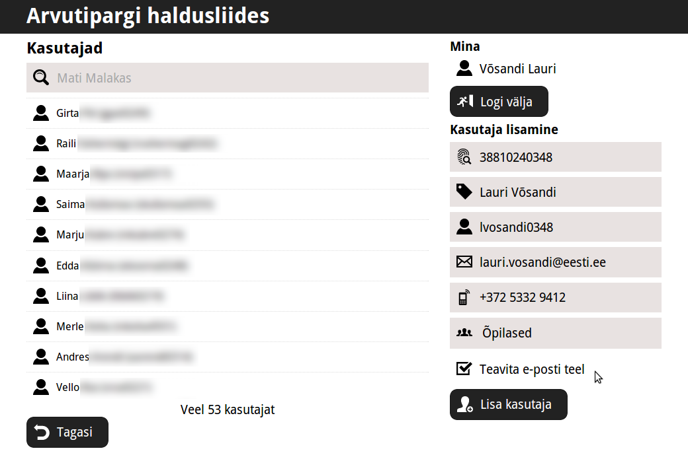
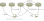
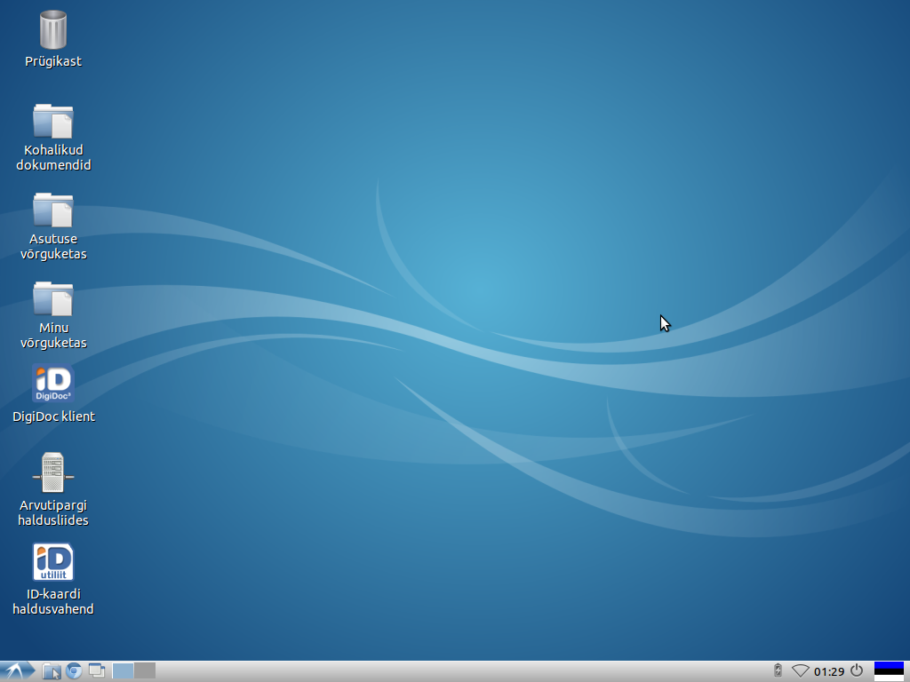
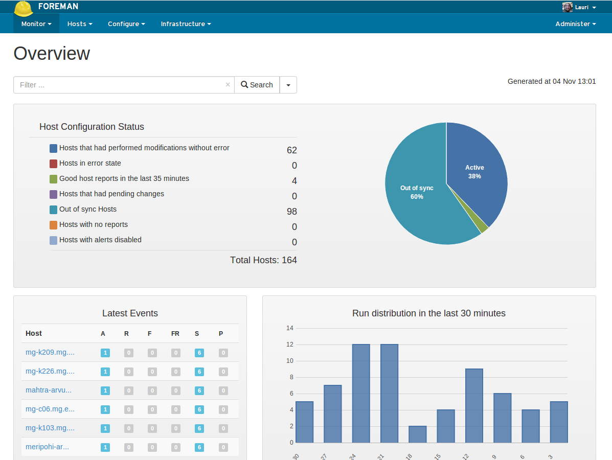

.. published: 2014-11-04
.. language: et
.. tags: tallinx, LTSP
.. redirect_from: /2014/11/edu-ee.html

Pisut pikemalt Tallinna koolide Linuxeerimise projektist
========================================================

Sissejuhatus
------------

Eelmise aasta lõpus kirjutati, et koolides läheb Windows'i ning Office'i
kasutamine kümme korda kallimaks, sest Microsofti jaoks pole me enam
"arengumaa".
Minu mäletamist mööda pidid Windows'i ja MS Office'i litsentsitasud tõusma senise
6 EUR asemel 60 EUR-le masina kohta aastas.
Mõned kuud hiljem, 2014 veebruaris tuli jutuks, et Tallinna Haridusamet soovib
proovida Tallinna koolides Linuxit.
Ernst & Youngi kevadel valminud uuringu järgi säästaksid Tallinna koolid
Office'ist loobudes viie aastaga 490 000 eurot,
Windowsi Linuxi vastu vahetades aga 700 000 eurot [#ei-jaksa]_.
Mina osalesin selles pilootprojektis ning tegelesin tehnilise poolega.

Eile, 3. novembril lugesin Eesti Päevalehest, et Tallinna Haridusamet jätkab Windowsi peal [#ei-l2he]_.
Selles artiklis on ajakirjanik tõlgendanud teemat meelevaldselt ja ebapädevalt,
analoogselt mõnda aega tagasi kirjutatud artiklile
"München läheb Windowsile tagasi" [#munich-going-back]_.
Hoolimata artiklis kirjutatust pilootprojekt jätkub ning riistvara soetamisel
lubatakse tulevikus rohkem tähelepanu pöörata Linuxi toele.
Loodan, et ajakirjanikupreili sai oma klikid täis ning kuupalga ausalt välja teenitud.

Ootusterikas algus
------------------

Kuna projektis osalenud koolide IT-tugiisikutel ei olnud enne projekti käivitumist
Linuxi administreerimise kogemust, siis otsustasin tsentraliseerida teenuseid
nii palju kui saab, et kohalikel IT-tugiisikutel oleks üleminek Windowsilt
Linuxile võimalikult lihtne ning nad ei oleks **sunnitud** õppima uusi asju.
Teenuste hulka kuulusid näiteks:

* Kaughaldus, et saaks masinatele tarkvara peale lasta ja seadistusi muuta (Puppet, Salt, ansible, Chef vms)
* Kasutajate autentimine ja autoriseerimine (LDAP, Kerberos, Active Directory jms)
* Võrguketas (Samba, NFS, sshfs, OwnCloud vms)
* Keskne logimine, et oleks võimalik tuvastada, mis juhtus kui midagi ei tööta
* Kaugtöölaua server, et oleks võimalik ka kodust koolis kasutatavaid rakendusi pruukida

Mainiksin siinkohal, et Eestis on puudus ka headest Windowsi administraatoritest.

Tehnilistest valikutest
-----------------------

Järgnevalt tutvustaksin natukene ka pilootprojekti käiku ja tehniliste valikute tagamaid.
Algselt pidime võtma kasutusele Müncheni migratsiooni jaoks loodud tarkvara GOsa2.
Kahjuks aga tähendanuks see, et kohalikud IT-tugiisikud oleksid pidanud saama
põhjaliku koolituse ning selle kasutamine nõuab ka palju nn käsitööd.
Teine minu arvates väga oluline aspekt projekti juures oli see, et ma tahtsin
aru saada kuidas erinevad tarkvarakomponendid kokku sobituvad ning probleemi
korral ma oleksin valmis sukelduma logidesse ning probleemi lahendama poole tunni jooksul.

.. figure:: http://i1-linux.softpedia-static.com/screenshots/GOsa_2.png

    Kasutaja lisamine GOsa2-s nõuab tippimist
    
Uurisin peale GOsa2 mitmeid teisi lahendusi ja reaalsus on see, et meil on isikukood,
mille järgi saab näiteks Sertifitseerimiskeskuse LDAP serverist pärida
eesnime, perekonnanime, riiklikku e-posti ning ID-kaardi sertifikaate.
See muudab eestlaste jaoks enamiku olemasolevatest karbitoodetest (Zentyal jms)
ebaeffektiivseteks.
Minu jaoks on seni arusaamatu, miks ei lubatud selle projekti puhul salvestada
tervet isikukoodi, küll aga oli täiesti okei kasutada viimast nelja numbrit.
Teades sünnipäeva ja sugu saab neist neljast numbrist teadupärast
tuletada terve isikukoodi.
Andmekaitse on korduvalt öelnud, et isikukood ei ole salajane ning
kasutaja üheselt tuvastamiseks on see ainus reaalne meetod [#andmekaitse]_.

Piloodi juures oli arvestatud arendustöödega ja seetõttu püüdsin 
kiirelt kokku visata mingisuguse veebiliidese millega kasutajaid hõlpsalt lisada saaks:

    Minu kirjutatud LDAP haldusliideses pisab isikukoodi sisestamisest

Märtsikuus hakkas tõsisem töö pihta, panin püsti Puppet, LDAP ja võrguketta serverid.
Esialgu püüdsime võrguketast ehitada OwnCloud 6 baasil aga OwnCloud oli
tol hetkel veel ebaküps.
Tahaksin siinkohal rõhutada ka seda et OwnCloud on eelkõige äriprojekt ning
kogukonna aitamine on pigem PR-trikk.
OwnCloud 7.0.3 on 2014 novembrikuu seisuga juba üsna kasutuskõlblik,
hetkel on puudub vaid mõistlik moodus kohalikku klientrakendust seadistada ning autentida.

Samba ning NFS langesid kohe valikust välja, kuna nad ei paku krüpteerimist
ning näiteks Rootsi TELE2 filtreerib turvalisuse huvides välja Samba pakette.
Isiklikule kogemusele tuginedes valisin SFTP kuna
tegu on krüptograafilisest seisukohast turvalise protokolliga mis tugineb OpenSSH-le.
Ma olin eelnevalt kasutanud SFTP-d igapäevaselt mitme aasta jooksul,
pannes pelgalt sftp://kasutaja@masin aadresse oma järjehoidjatesse.
Arvutisse sisse logides lisatakse jooksvalt genereeritud
võtmele vastav avalik võti võrgukettale ning sessiooni vältel saab võrguketast kasutada paroolita.
Töölaua sessioonist välja logides avalik võti eemaldatakse.

Pikemas perspektiivis tuleks kasutusele võtta Kerberos millega saaks suvalist
võrguketta protokolli mugavalt autentida ilma paroolita.
OwnCloudi klientrakendus vajab arendustööd ja hetkeseisuga ma pole kindel kas see OwnCloudi
avatud lähtekoodiga variandis üldse kasutatav saab olema.
Samba4 failiserverit peaks saama juba praegu seadistada Kerberose toega.
Heiki Tähise sõnul peaks modernne Samba toetama ka läbipaistvat krüpteerimist 
kasutades IPsec protokolli.

    Arhitektuur 2014 aasta novembri seisuga

Asutuste arvutisse paigaldasime Lubuntu 12.04 baasil Estobuntu.

    Ubuntu 12.04 baasil LXDE töölaud on minimalistlik ja peamenüü on tuttavas kohas

Selle tegevuse tulemusena saime aprilli lõpuks töökohad ning teenuseid enam-vähem tööle.

Puppeti profiil sai tehtud pidades meeles, et ühel kenal päeval
saab võrguketta või LDAP-i kohalikku asutuse masinasse paigaldada.
Foreman on Puppeti veebiliides, mis võimaldab saada ülevaate masinatest:

    Foreman annab ülevaate arvutipargist
    
Tööjaamade juurfailisüsteemi jaoks kasutasime hetkel järgnevast nimistust
esimest varianti, aga ilmselt tuleb siin veel mitut erinevat varianti koolidele pakkuda:

1. Operatsioonisüsteem on sisemisele kettale paigaldatud, Puppet haldab
2. Operatsioonisüsteem on sisemisele kettale paigaldatud, majandatakse btrfs tõmmistega
3. Kõvaketta tõmmis laetakse võrgust alglaadimisel, pole kindel veel kuidas seda teostada võiks
4. Kõvaketast pole, masin teeb PXE alglaadimist ja haagib võrgust read-only NFS juurfailisüsteemi [#nfsroot]_
5. Kasutada LTSP5 baasil terminal-serverit nii nagu Rahvusraamatukogus [#ltsp]_

Oleme agiilsed
--------------

Ma olen kindel, et praeguses ja ka tulevastes variantides on tõsiseid turvaprobleeme
ning loodan, et enne neist probleemidest teavitataks eelkõige mind ja
võin anda enda poolt lubaduse, et vaev ei jää tasumata.
Ideaalset süsteemi on võimatu projekteerida, pigem tuleb alati olla 
kohanemisvõimeline ning valmis muudatusteks.
Septembris pidasime nõu EENeti arendajatega, kuna nemad olid teinud analoogset
autentimismehhanismi [#taat]_ umbkaudu neli kuud.
Jõudsime kokkuleppele, et viskame OpenLDAP-i välja ja
teeme Samba4 kohalikuks domeeni kontrolleriks ehk
siis maakeeli panna pakkuma LDAP, Kerberos, DNS ja failiserveri teenuseid,
mille külge ennast ka Windows masinad saaks haakida.
EENeti kavas on panna eduroam autentima nende samade domeenikontrollerite pihta.
Võrguketas tuleks samamoodi üle viia OwnCloudile, et meil oleks rohkem
võimalusi erinevate seadmete ühildamiseks võrgukettaga.
    

    Minu nägemus "ideaalsest" arhitektuurist
    
    
Probleemid
----------

Arvutite ühilduvusega probleeme polnud, küll aga tuli mõnele uuemale
arvutile Ubuntu 12.04 asemel paigaldada Ubuntu 14.04.
Osadel arvutitel oli ka sisse-ehitatud Transcend kaardilugeja,
mis ei kasuta standardiseeritud viisi operatsioonisüsteemiga suhtlemiseks [#transcend]_ ning
nendele masinatele tuli lisada väline ID-kaardilugeja.
Canon printerite tüürel (CAPT v2.60) jookseb suvaliselt kokku ning
on praktiliselt kasutuskõlbmatu.
Isiklikest Windowsi masinatest Swish abil võrguketta monteerimine ei tööta
täpselt nii nagu tahta võiks, nimelt peab võrguketta kataloogist faili kohalikku
masinasse lohistama ning peale redigeerimist tagasi lohistama.

Pilootprojekti üheks osaks olid ka Smarttechi tahvlid,
mille Eesti esindaja väitis, et nendel on olemas Linuxi tugi.
Kahjuks ei olnud nad seda ise katsetanud ning ei minul ega
kolmel teisel spetsialistil ei õnnestunud Smarttechi tarkvara täielikult käima saada.
QOMO tahvlitega oli situatsioon analoogne. Näiteks QOMO draiver, mis
pole küll päris draiver vaid lihtsalt *userspace binary blob* 
teeb näiteks iga sekundi tagant ``chmod 777 /dev/ttyUSB0``
mis näitab väga hästi seda, et arendaja jaoks oli udev reegli tegemine üle mõistuse ja
mindi kergema vastupanu teed.

Igasuguste tavalise probleemide hulka sattus ka Tallinna linnavalitsuse
SAP-i veebiliides.
Nimelt ei olnud sealt võimalik printida ettejuhtuvat väljavõtet ja süüdistati
selles Ubuntut.
Käisid seal mitu IT-alase haridusega inimest, aga seda keegi muidugi ei märganud,
et Tallinna linnavalitsuse SAP-i veebiliides reklaami näitab...
Mingil moel oli veebilehitseja järjehoidjate hulka sattunud
https://sapveeb.tallinnlv.ee/sapveeb/tallinn/ asemel
http://www.similarsites.com/goto/sapveeb.tallinnlv.ee?searchedsite=sapveeb.tallinnlv.ee&pos=0

90ndate töövoost loobumine
--------------------------

Ühes Tallinna koolis oli näiteks 80 arvuti kohta 40 printerit.
See illustreerib väga hästi kasutusel olevat 90ndate töövoogu,
mis tugineb dokumendi koostamisele tekstitöötlusprogrammis ning selle printimisele.
Printerite ühildamine Ubuntu all oli problemaatiline rääkimata sellest,
et iga printer vajab ju oma ainulaadset toonerit.

Minu **isiklik arvamus** on, et suvaline failipõhine kontoritarkvara on ajast ja arust.
Kasutajal peab olema paigaldatud vastav programm, et seda faili avada ja
redigeerida.
Vahepealse sammuna peaksime harima asutustes töötavaid inimesi,
et nad asutusest välja saadaks näiteks PDF faile.
Juhiksin tähelepanu ka sellele, et PDF failidesse
saab juba päris pikalt vorme tekitada, seega muudetavate dokumentide saatmine ei tohiks probleemiks olla.
Ma saan aru et see muutus ei saa tulla päevapealt aga tahan öelda ka seda, et lõplik vastus probleemile
ei ole veebipõhine kontoritarkvara nagu Google Docs või Office 365.

Suvaline tekstidokument ei ole lihtsalt masintöödeldav ning
programmeerija seisukohast tahaksin öelda, et selle koostamiseks kulutatud aeg on maha visatud aeg.
Seevastu andmebaasi sisestatud andmetel on kontekst,
neid saab töödelda, statistikat koguda jne.
Pikemas perspektiivis tuleks üleüldse 90ndate töövoost lahti saada ning
kolida asjad üle veebirakendustele.
Selle tulemusena muutuks primaarseks tööriistaks veebilehitseja ja
inimesed saaksid teenuste tarbimiseks kasutada ka oma isiklikke seadmeid
(*bring your own device*) ning seetõttu saaks vähendada
traditsiooniliste töölaua arvutite hulka asutustes.

Väga hea näide on lasteaedades praktiseeritav
tabelarvutuse töövoog, kus rühma õpetaja märgib laste kohaloleku tabelarvutuse malli
ning saadab selle asutuse juhile, kes siis saadab selle edasi toitlustusfirmasse.
Säärane info peaks olema veebis, kuna mingi hetk tekib lapse rahakotti naguinii mingisugune
NFC kaart ning lasteaeda jõudes piisaks kohaloleku märkimiseks kaardi viibutamisest lasteaia ukse juures.
Lasteaia töötajatel oleks jälle natukene rohkem aega formaalsuste asemel lastega tegeleda.
See on lihtsalt üks näide sellest kuidas mõtlemine ei küündi kahest sammust kaugemale
rääkimata kümnest või kahekümnest.

Mul on olnud au väärika tasu eest õpetada Tartu Ülikooli geneetikutele ning
Tallinna Tehnikaülikooli energeetikutele Pythoniga andmekogude analüüsimist ja
töötlemist programmaatilsel viisil.
Teadusliku töö aluseks on korratavus ning tabelarvutuses lahtrite kopeerimine ja kleepimine sellena ei kvalifitseeru.
Käsitööd asendav koodijupp, mis genereerib näiteks CSV kujul olevatest
sisendandmetest HTML kujul oleva raporti on
seevastu versioneeritav ning seda saab kolleegidega jagada.
Tahaks hariduses näha rohkem säärast tendentsi ning leian,
et koolil juba põhikooli astmes on võtmeroll selle mõtteviisi juurutamisel.

Kulude vähendamisest
--------------------

IT-valdkonnas on levinud arusaam, et Linuxil töötava arvuti haldamiseks piisab
vaid Ubuntu paigaldamisest ning see tiksub rahulikult mitu aastat ja
seda ei olegi vaja hooldada.
Paraku on Linuxi masinate haldamine pisut mahukam töö, kuna
avatud lähtekoodiga tarkvara on pidevas muutumises ning
pean ütlema, et olen kulude vähenemise prognoosi
osas mingil määral nõus Heiki Tähisega [#linux-koolidesse-ja-kokkuhoid]_.
Pingviinilisele ülemineku puhul **ei saa** eeldada, et kulud kokkuvõttes lähevad nulli.
Samas korralikku kaughaldusvahendit kasutades on Ubuntuga
märgatavalt lihtsam skaleeruda, kuna ühes masinas tehtud kaughalduse profiil
rakendub suvalisele arvule masinatele.
Teisiti öeldes mida rohkem Ubuntuga masinaid ühe keskhaldusserveri külge liita
seda paremini on nende kaughalduse profiil testitud ja kokkuvõttes seda paremini nad töötavad.

Ülemineku peamiseks eesmärgiks peaks olema eelkõige kulude investeerimine oma inimestesse.
See on vajalik, et Eesti hakkaks eksportima, mitte importima IT-lahendusi ja teenuseid.
Loodetavasti tõstaks see ka elatustaset Eestis.
Ideaalis tahaks ma muidugi näha arvutiklassides *triple-boot* masinaid,
et õpilastel oleks võimalik tutvuda võimalikult erinevate lahendustega.
See omakorda nõuab seda et nii Linuxi, Maci kui Windowsi spetsialistid
astuvad välja oma mugavustsoonist ja on valmis koostööks.

Kokkuvõte
---------

Tagasi vaadates pean tõdema,et see oli hea näide, et ma ise ei olnud
piisavalt pädev selles projektis osalemaks ning seitse aastat oma lõbuks
nokitsemist ei ole piisav, et suurt arvutiparki hallata.
Tänu sellele projektile olen ma ise väga palju õppinud, eelkõige LDAP-i,
Kerberose ja Puppeti kohta ning ütlen siinkohal aitäh, sest ilmselt see
kogemus aitab mul jaanuaris ära teha viimase LPIC-2 [#lpic]_ jaoks tarviliku eksami.

Sellise arvutipargi haldamiseks on vaja vähemalt kahte väga pädevat Linuxi
administraatorit, kes keskenduvad pelgalt Linuxi serverite ja tööjaamade haldusele.
Lisaks võiks olla kolmas spetsialist turvalisuse auditeerimiseks.
Kohalikud IT-tugiisikuid peab koolitama vigadest teatama ning soovi
korral aitama neil teenuseid kohalikuks viia.
IT-tugiisikutel peab säilima turvatunne, et serverite administraatorid
nende leiba ära ei varastaks ning serverite administraatorite ja
kohalike IT-tugiisikute vahel tekiks teatav sümbioos.

Arengukava mustand
------------------

Minu arvates ei ole ühelgi IT-inimesel ega ka Haridusametil vähimatki aimu
kuidas arvuteid koolides kasutatakse ja selle osas on vaja palju tööd teha.
Järgnev on minu poolt välja pakutud arengukava kõigile haridusasutustele:

* Reaalselt analüüsida koolide arvutikastust ja praeguseid töövoogusid
* Lähtuvalt praegusest situatsioonist töötada välja kava kuidas asju odavamalt/effektiivsemalt/energiasäästlikumalt/jne teha
* Panna paika protsessid kuidas neid tegevusi tulevikus teha võiks
* Lähtuda riigi IT arhitektuuri arengukavast, mis nõuab standardiseeritud vormingute kasutamist [#riigi-it-arhitektuur]_
* Eelistada veebirakendusi kus võimalik ja loogiline
* Uutelt arendustelt nõuda, et need oleks OS-agnostilised, see omakorda enamasti tähendab veebipõhisust
* Uued lahendused oleks tarbitavad ka isiklikel nutitelefonidel
* Veebirakenduste puhul nõuda API-tsentrilisust, et neid infosüsteeme saaks masina kombel teistega siduda
* Hoidma aus tervet mõistust (*common sense*)
* Otsuseid tegema läbipaistval viisil ning võimalikult palju kaasama otsuste langetamisse inimesi kellel on erialane taust

Kava tulemusena peaks:

* Operatsioonisüsteemi küsimus muutuma väheoluliseks kui mitte tähtsusetuks
* Koolide IT süsteemidel olema platvormi-agnostiline keskne autentimine, kaughaldus ja võrguketas
* Mac OS X-i ning Ubuntu kasutajad saaks inimese kombel koolide ja teiste asutustega asju ajada
* Koolides **saama** luua reaalselt heterogeenseid kooslusi a'la Windows-Ubuntu-Mac OS X *tripleboot*
* Eesti Vabariik saaks jätkata edumeelse e-riigi tiitli kandmist

Ja mis kõige olulisem - **järjepidevust** on vaja läbi aastate mitte pelgalt järgmiste valimisteni.
Suvalise tarkvaraprojekti puhul tehakse plaane ikkagi 7+ aasta perspektiivis.

.. [#ei-jaksa] http://epl.delfi.ee/news/eesti/eesti-koolid-ei-jaksa-enam-microsoftilt-tarkvara-osta?id=67076102
.. [#ei-l2he] http://epl.delfi.ee/news/eesti/uuringud-tehtud-tallinna-koolid-taielikult-linuxile-ule-ei-lahe?id=70063285
.. [#munich-going-back] http://www.zdnet.com/after-a-10-year-linux-migration-munich-considers-switching-back-to-windows-and-office-7000032714/
.. [#andmekaitse] http://uudised.err.ee/v/vr/varia/f1275ade-a858-497d-aa51-477badd685b6
.. [#linux-koolidesse-ja-kokkuhoid] http://www.heiki.org/post/2014/04/23/Linux-koolidesse-ja-kokkuhoid.aspx
.. [#taat] http://taat.ee/
.. [#transcend] https://bitbucket.org/lauri.vosandi/lauri-edu/issue/18/transcend-cr-75-51-in-1-card-reader
.. [#nfsroot] http://lauri.vosandi.com/2014/08/cubietruck-over-nfs.html
.. [#ltsp] http://lauri.vosandi.com/2012/07/ubuntu-precise-pangolin-ltsp-ja-id-kaart.html
.. [#lpic] https://www.lpi.org/linux-certifications/programs/lpic-2
.. [#riigi-it-arhitektuur] http://www.riso.ee/et/koosvoime/arhitektuur
